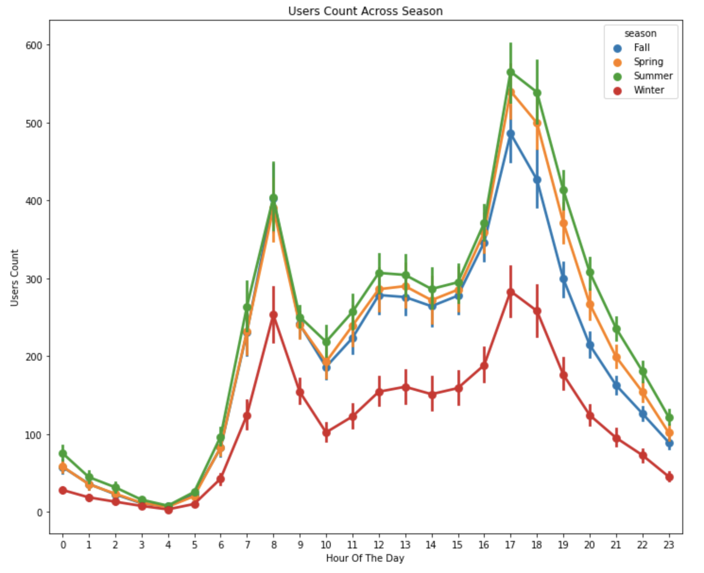

# Portfolio
---
 
## Projects
 
### Bike Sharing Demand with Linear Regression, Random Forests and Gradient Boosting 

In this Keggle competition, participants are asked to combine historical usage patterns with weather data in order to forecast bike rental demand in the Capital Bikeshare program in Washington, D.C. The training set is comprised of the first 19 days of each month, while the test set is the 20th to the end of the month. The goal is to predict the total count of bikes rented during each hour covered by the test set, using only information available prior to the rental period
Given the train set, after a thorough analysis of the data, I developed and compared the performance of three different models based on their RMSLE score.

 

 

 
### Bike Sharing Demand with Linear Regression, Random Forests and Gradient Boosting 

In this Keggle competition, participants are asked to combine historical usage patterns with weather data in order to forecast bike rental demand in the Capital Bikeshare program in Washington, D.C. The training set is comprised of the first 19 days of each month, while the test set is the 20th to the end of the month. The goal is to predict the total count of bikes rented during each hour covered by the test set, using only information available prior to the rental period
Given the train set, after a thorough analysis of the data, I developed and compared the performance of three different models based on their RMSLE score.

 

 

---
## Papers

### Swarm Driving with Deep Learning

### Cloud-Based Cyber Physical Systems

### Model and Verify Cyber-Physical Systems CPS with Communicating Sequential Processes (CSP)

### Bachelor Thesis

